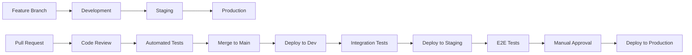

# Astropa Deployment Guide

This guide covers the complete deployment process for the Astropa application across different environments using modern DevOps practices.

## Table of Contents

- [Prerequisites](#prerequisites)
- [Local Development](#local-development)
- [Cloud Infrastructure](#cloud-infrastructure)
- [Kubernetes Deployment](#kubernetes-deployment)
- [Monitoring Setup](#monitoring-setup)
- [CI/CD Pipeline](#cicd-pipeline)
- [Production Checklist](#production-checklist)
- [Troubleshooting](#troubleshooting)

## Prerequisites

### Required Tools

- **Docker** (>= 20.10)
- **kubectl** (>= 1.25)
- **Helm** (>= 3.10)
- **Terraform** (>= 1.0)
- **AWS CLI** (>= 2.0) - for cloud deployment
- **ArgoCD CLI** (>= 2.8) - for GitOps

### Required Access

- AWS Account with appropriate permissions
- Container registry access (GitHub Container Registry)
- Kubernetes cluster access
- Git repository access

## Local Development

### Quick Start with Docker Compose

```bash
# Start all services locally
docker-compose up -d

# Check service status
docker-compose ps

# View logs
docker-compose logs -f

# Stop services
docker-compose down
```

### Kubernetes Local Development

```bash
# Create local cluster (using kind/minikube)
kind create cluster --name astropa-local

# Install NGINX Ingress
kubectl apply -f https://raw.githubusercontent.com/kubernetes/ingress-nginx/main/deploy/static/provider/kind/deploy.yaml

# Deploy application using Helm
helm install astropa ./k8s/helm-chart \
  --namespace astropa \
  --create-namespace \
  --values ./k8s/helm-chart/values.yaml

# Port forward to access services
kubectl port-forward -n astropa svc/astropa-frontend 8080:80
kubectl port-forward -n astropa svc/astropa-backend 8081:8080
```

## Cloud Infrastructure

### AWS Infrastructure with Terraform

1. **Initialize Terraform**
```bash
cd terraform
cp terraform.tfvars.example terraform.tfvars
# Edit terraform.tfvars with your values
terraform init
```

2. **Plan Infrastructure**
```bash
terraform plan -var-file="terraform.tfvars"
```

3. **Deploy Infrastructure**
```bash
terraform apply -var-file="terraform.tfvars"
```

4. **Configure kubectl**
```bash
aws eks update-kubeconfig --region us-west-2 --name astropa-dev
```

### Infrastructure Components

The Terraform configuration creates:

- **VPC** with public/private subnets
- **EKS Cluster** with managed node groups
- **RDS MySQL** instance for production database
- **ElastiCache Redis** for caching
- **Application Load Balancer** for ingress
- **S3 Bucket** for application storage
- **IAM Roles** and policies
- **Security Groups** and KMS keys

## Kubernetes Deployment

### Using Helm Charts

1. **Add Required Helm Repositories**
```bash
helm repo add bitnami https://charts.bitnami.com/bitnami
helm repo add prometheus-community https://prometheus-community.github.io/helm-charts
helm repo update
```

2. **Install Dependencies**
```bash
# Install MySQL (if not using external RDS)
helm install mysql bitnami/mysql \
  --namespace astropa \
  --create-namespace \
  --set auth.database=astropa \
  --set auth.username=astropa

# Install Redis (if not using external ElastiCache)
helm install redis bitnami/redis \
  --namespace astropa \
  --set auth.enabled=false
```

3. **Deploy Application**
```bash
# Development environment
helm install astropa ./k8s/helm-chart \
  --namespace astropa \
  --create-namespace \
  --values ./k8s/helm-chart/values.yaml

# Production environment
helm install astropa ./k8s/helm-chart \
  --namespace astropa \
  --create-namespace \
  --values ./k8s/helm-chart/values-production.yaml
```

### Using ArgoCD (GitOps)

1. **Install ArgoCD**
```bash
kubectl create namespace argocd
kubectl apply -n argocd -f https://raw.githubusercontent.com/argoproj/argo-cd/stable/manifests/install.yaml

# Get admin password
kubectl -n argocd get secret argocd-initial-admin-secret -o jsonpath="{.data.password}" | base64 -d
```

2. **Deploy Application via ArgoCD**
```bash
kubectl apply -f k8s/argocd/application.yaml
```

3. **Access ArgoCD UI**
```bash
kubectl port-forward svc/argocd-server -n argocd 8080:443
# Access https://localhost:8080
```

## Monitoring Setup

### Prometheus and Grafana Stack

1. **Deploy Monitoring Stack**
```bash
kubectl apply -f monitoring/prometheus-stack.yaml
```

2. **Access Grafana**
```bash
kubectl port-forward -n monitoring svc/prometheus-stack-grafana 3000:80
# Access http://localhost:3000 (admin/admin123)
```

3. **Configure Custom Dashboards**
- Import dashboard for Spring Boot applications
- Set up alerts for application metrics
- Configure notification channels

### Application Metrics

The backend exposes metrics at `/actuator/prometheus` endpoint:
- HTTP request metrics
- JVM memory and CPU usage
- Database connection pool stats
- Custom business metrics

## CI/CD Pipeline

### GitHub Actions Workflow

The pipeline includes:

1. **Build Stage**
   - Maven build with tests
   - Angular build
   - Docker image creation

2. **Security Stage**
   - Dependency vulnerability scanning
   - Container image scanning
   - Code quality analysis with SonarQube

3. **Deploy Stage**
   - Push images to registry
   - Update Kubernetes manifests
   - Trigger ArgoCD sync (GitOps)

### Environment Promotion



## Production Checklist

### Pre-Deployment

- [ ] Infrastructure provisioned and tested
- [ ] DNS records configured
- [ ] SSL certificates installed
- [ ] Secrets and configuration validated
- [ ] Database migrations tested
- [ ] Backup and restore procedures tested

### Security

- [ ] Network policies configured
- [ ] RBAC permissions set
- [ ] Container security policies applied
- [ ] Secrets encrypted at rest
- [ ] Audit logging enabled
- [ ] Vulnerability scanning completed

### Performance

- [ ] Resource limits configured
- [ ] Horizontal Pod Autoscaler set up
- [ ] Database connection pooling optimized
- [ ] Caching strategy implemented
- [ ] CDN configured for static assets

### Monitoring

- [ ] Health checks configured
- [ ] Application metrics exposed
- [ ] Alerting rules set up
- [ ] Log aggregation configured
- [ ] Dashboard created
- [ ] On-call procedures documented

## Troubleshooting

### Common Issues

1. **Pod Startup Issues**
```bash
# Check pod status
kubectl get pods -n astropa

# View pod logs
kubectl logs -n astropa deployment/astropa-backend

# Describe pod for events
kubectl describe pod -n astropa <pod-name>
```

2. **Database Connection Issues**
```bash
# Test database connectivity
kubectl run mysql-client --rm -it --image=mysql:8.0 -- mysql -h <host> -u <user> -p

# Check database secrets
kubectl get secret -n astropa astropa-secrets -o yaml
```

3. **Ingress Issues**
```bash
# Check ingress status
kubectl get ingress -n astropa

# Test service connectivity
kubectl port-forward -n astropa svc/astropa-backend 8080:8080
```

### Performance Issues

1. **High Memory Usage**
   - Check JVM heap settings
   - Review application memory leaks
   - Adjust resource limits

2. **Slow Response Times**
   - Check database query performance
   - Review caching strategy
   - Analyze application profiling

3. **Pod Restart Issues**
   - Check resource limits
   - Review health check configuration
   - Analyze startup time

### Monitoring and Alerts

1. **Application Down**
   - Check pod status and logs
   - Verify ingress configuration
   - Test external dependencies

2. **High Error Rate**
   - Review application logs
   - Check external service status
   - Analyze error patterns

3. **Resource Exhaustion**
   - Scale horizontally if needed
   - Optimize resource usage
   - Review autoscaling configuration

## Emergency Procedures

### Rollback Deployment

```bash
# Helm rollback
helm rollback astropa -n astropa

# ArgoCD rollback
argocd app rollback astropa --revision <previous-revision>

# Manual rollback
kubectl rollout undo deployment/astropa-backend -n astropa
```

### Scale Application

```bash
# Scale backend
kubectl scale deployment astropa-backend --replicas=5 -n astropa

# Scale frontend
kubectl scale deployment astropa-frontend --replicas=3 -n astropa
```

### Database Recovery

```bash
# Restore from backup
# (Specific steps depend on your backup solution)

# Point-in-time recovery for RDS
aws rds restore-db-instance-to-point-in-time \
  --db-instance-identifier astropa-restore \
  --source-db-instance-identifier astropa-production \
  --restore-time 2024-01-15T12:00:00.000Z
```

## Support and Maintenance

### Regular Tasks

- Monitor application performance
- Review and rotate secrets
- Update dependencies
- Perform security scans
- Backup verification
- Disaster recovery testing

### Scheduled Maintenance

- Database maintenance windows
- Kubernetes cluster upgrades
- Certificate renewals
- Security patches

For additional support, consult the [Operations Runbook](./OPERATIONS_RUNBOOK.md) or contact the development team.